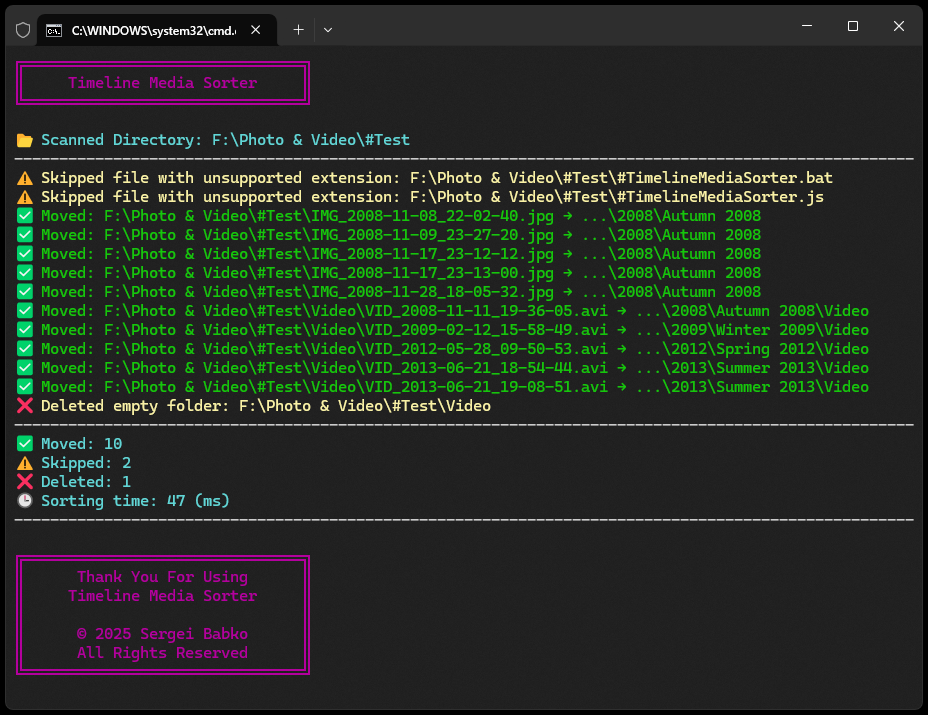

# 🗂 Timeline Media Sorter

<p align="center">
  
</p>

**TimelineMediaSorter** is a simple Node.js script that helps you organize photos and videos into folders by year and season, based on the date in their filenames.

---

## 🏷️ Works Great With - [Timeline Media Renamer](https://github.com/SergeiBabko/Timeline-Media-Renamer)

---

## 🔧 What It Does

* Scans your media files and sorts them into folders like:

    * `2023/Spring/`
    * `2024/Winter/Video/`
    * `2025/Trip to Italy/`

* Detects dates from filenames (e.g. `IMG_2025-03-15_12-30-56.jpg`)
* Supports **custom user-defined events** — define your own event folders with optional date ranges, including recurring yearly events
* Separates photos and videos into respective folders
* Skips unsupported files
* Removes empty folders afterward
* Shows results in English or Russian (based on your system)
* Gives a short summary with time taken and how many files were sorted

---

## 🚀 How to Use

1. Install [Node.js](https://nodejs.org)

2. Place the script in the folder with your media files

3. *(Optional)* Customize the `TimelineMediaSorterSettings` class in the script to configure:

    * `SAVE_LOGS` — set to `true` to save logs to a file after sorting, or `false` to disable log saving.

    * `CUSTOM_EVENTS_DATES` — an array of strings defining custom events with optional date ranges in `"DD.MM.YYYY"` format.

      Format example:

      ```
      "FolderName|Event Name: startDate-endDate"
      ```

        * You can nest events into subfolders using the pipe character (`|`) as separator in `FolderName`.
        * Dates support recurring yearly events by using `"x"` as the year (e.g., `"31.12.x-01.01.x"`).
        * End date can be omitted for single-day events.
        * If the end date is earlier than the start date, the event is considered to cross the new year boundary.

    * `IGNORE_DIRECTORIES` — folders to skip during scanning (e.g., `#Ignored`).

4. Run the script:

    * Double-click `#TimelineMediaSorter.bat`
    * Or run manually in terminal:

      ```bash
      node "#TimelineMediaSorter.js"
      ```

5. Done! Your files will be organized automatically into dated folders.

---

## 📦 Supported File Types

The script automatically detects and organizes the following file formats:

### 🖼️ Image & Photo Extensions

```
.jpg, .jpeg, .png, .gif, .bmp, .tiff, .tif, .heic, .heif, .webp,
.raw, .arw, .cr2, .nef, .orf, .sr2, .dng, .rw2, .raf, .psd,
.xcf, .ai, .indd, .svg, .eps, .pdf, .lrtemplate, .xmp
```

### 🎞️ Video Extensions

```
.3gp, .mp4, .mov, .avi, .mkv, .webm, .flv, .wmv, .mpeg, .mpg, .m4v,
.mts, .m2ts, .vob, .rm, .rmvb, .asf, .divx, .xvid, .ogv, .ts, .mxf,
.f4v, .m2v, .mpv, .qt, .mng, .yuv, .y4m, .drc, .f4p, .f4a, .f4b
```

All other file types are skipped automatically.

---

## 📁 Example Output

```txt
📂 2025
├── 📂 Spring
│   └── 🖼️ IMG_2025-03-20.jpg
├── 📂 Summer
│   ├── 📂 Video
│   │   └── 🎞️ VID_2025-07-01.mp4
│   └── 🖼️ IMG_2025-07-23.jpg
│
📂 #Unknown Dates
└── 🖼️ some_old_image.png
```

---

## ℹ️ Notes

* Date detection looks for patterns like `YYYY-MM-DD_HH-MM-SS` in filenames.
* If no date is found, files are placed into the `#Unknown Dates` folder.
* Custom events take priority over default seasonal folders.
* Videos are always placed inside a `Video` subfolder within their date/event folder.
* Empty folders are removed after sorting.
* Skips files with unsupported extensions.
* Folder scanning ignores directories listed in `IGNORE_DIRECTORIES`.
* Log output color-codes messages for clarity.
* When `SAVE_LOGS` is `true`, all logs are saved to `#TimelineMediaSorterLogs.txt` in the root folder.
* Disabling `SAVE_LOGS` will prevent log file creation but still display console output.

---

## 📊 After Sorting

* Displays the count of moved, skipped, and deleted files
* Shows elapsed sorting time in a human-readable format
* Summary and status messages are localized based on system language (English/Russian)
* Highlights errors such as folder creation failures or move operation errors
* Supports quiet operation by toggling log saving

---

## 📁 Configuration Examples for Custom Events and Logs

```js
class TimelineMediaSorterSettings {
  static SAVE_LOGS = true;              // Enable log saving

  static CUSTOM_EVENTS_DATES = [
    'New Year: 31.12.x-01.01.x',        // Recurring New Year event spanning Dec 31 - Jan 1
    'Christmas: 24.12.x-26.12.x',       // Recurring Christmas event
    'Birthdays|My Birthday: 02.01.x',   // Recurring birthday in nested "Birthdays" folder
    'Weddings|My Wedding: 01.02.2015',  // One-time wedding in 2015 in nested "Weddings" folder
  ];

  static IGNORE_DIRECTORIES = [
    '#Ignored',                         // This folder is skipped during scanning
  ];
}
```
