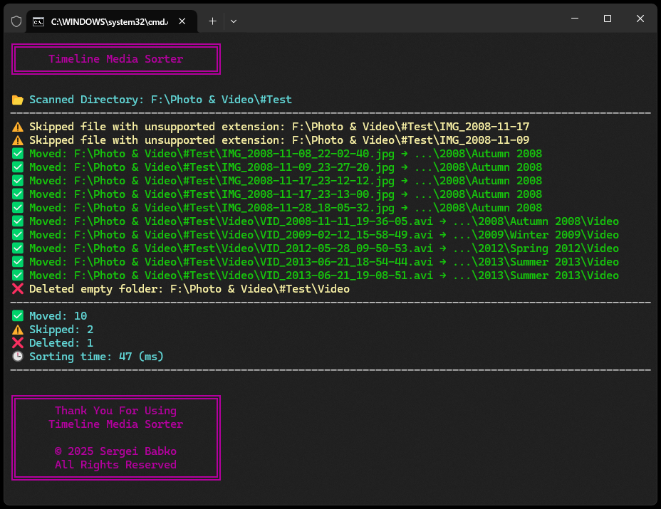

# 🗂 Timeline Media Sorter | [RU](https://github.com/SergeiBabko/Timeline-Media-Sorter/blob/main/README.RU.MD)

<p align="center">
  
</p>

**TimelineMediaSorter** is a simple Node.js script designed to organize your photos and videos into folders by year, season, or custom event based on the date extracted from the file name.

---

## 🏷️ Perfect Companion to — [Timeline Media Renamer](https://github.com/SergeiBabko/Timeline-Media-Renamer)

---

## 🔧 Features

* Scans media files and automatically sorts them into folders, such as:

    * `2023/Spring 2023/`
    * `2024/Winter 2023/Videos/`
    * `Trips/Trip to Italy 2025/`

* Extracts the date from the file name (e.g., `IMG_2025-03-15_12-30-56.jpg`)
* Supports **custom events** defined by you — including recurring annual ones
* Separates photos and videos into dedicated folders
* Skips unsupported file formats
* Removes empty folders after sorting
* Displays results in English or Russian based on your system language
* Prints a concise summary with runtime and file count

---

## 🚀 How to Use

1. Install [Node.js](https://nodejs.org)

2. Place the script into the folder with your media files

3. *(Optional)* Configure the `TimelineMediaSorterSettings` class:

    * `SAVE_LOGS` — set to `true` to save logs, or `false` to disable logging
    * `CUSTOM_EVENTS_DATES` — an array of strings with custom events in the `"DD.MM.YYYY"` format:

        * Recurring annual events are supported with `"x"` as the year — e.g., `Christmas: 24.12.x-26.12.x`
        * For single-day events, the end date can be omitted — e.g., `My Wedding: 01.02.2015`
        * If the end date is earlier than the start date, the event is treated as spanning New Year — e.g., `New Year: 31.12.x-01.01.x`
        * Use `|`, `\\`, or `/` to create nested folders — e.g.:
        * Events with a year specified must be recorded BEFORE annual events

        ```js
        "FolderName|Event": "startDate-endDate"
        "FolderName\\Event": "startDate-endDate"
        "FolderName/Event": "startDate-endDate"
        ```

    * `IGNORED_DIRECTORIES` — list of folders to skip (e.g., `#Ignored`)

4. Run the script:

    * Double-click `#TimelineMediaSorter.bat`, or
    * Run from terminal:

      ```bash
      node "#TimelineMediaSorter.js"
      ```

5. Done — your media will be automatically sorted into dated folders

---

## 📁 Possible Formatting Options for Custom Events

| Format Description                                               | Format Syntax           | Example                 | Start Date   | End Date     |
| ---------------------------------------------------------------- | ----------------------- | ----------------------- | ------------ | ------------ |
| Fixed one-day event                                              | `DD.MM.YYYY`            | `05.02.2000`            | `05.02.2000` | `05.02.2000` |
| Fixed multi-day range                                            | `DD.MM.YYYY-DD.MM.YYYY` | `10.03.2001-15.03.2001` | `10.03.2001` | `15.03.2001` |
| Fixed date range crossing into a new year                        | `DD.MM.YYYY-DD.MM.YYYY` | `25.12.2001-05.01.2002` | `25.12.2001` | `05.01.2002` |
| Fixed date range crossing over multiple years                    | `DD.MM.YYYY-DD.MM.YYYY` | `10.01.2002-10.01.2003` | `10.01.2002` | `10.01.2003` |
| Recurring one-day event with defined start and end years         | `DD.MM.YYYY_YYYY`       | `20.01.2004_2006`       | `20.01.2004` | `20.01.2006` |
| Recurring one-day event starting from the specified year         | `DD.MM.>YYYY`           | `25.01.>2007`           | `25.01.2007` | `25.01.x`    |
| Recurring multi-day event from a fixed start date                | `DD.MM.YYYY-DD.MM.x`    | `30.01.2010-30.01.x`    | `30.01.2010` | `30.01.x`    |
| Recurring multi-day event from a fixed start date (crossed)      | `DD.MM.YYYY-DD.MM.x`    | `25.12.2020-05.01.x`    | `25.12.2020` | `05.01.x`    |
| Recurring multi-day event up to a fixed end date                 | `DD.MM.x-DD.MM.YYYY`    | `25.03.2015-30.03.x`    | `25.03.2015` | `30.03.x`    |
| Recurring one-day event up to the specified year                 | `DD.MM.<YYYY`           | `30.01.<1980`           | `30.01.x`    | `30.01.1980` |
| Recurring multi-day event up to a fixed end date                 | `DD.MM.x-DD.MM.YYYY`    | `30.01.x-30.01.1985`    | `30.01.x`    | `30.01.1985` |
| Recurring multi-day event up to a fixed end date                 | `DD.MM.x-DD.MM.YYYY`    | `25.01.x-30.01.1990`    | `25.01.x`    | `30.01.1990` |
| Recurring multi-day event crossing into new year up to a year    | `DD.MM.x-DD.MM.YYYY`    | `25.12.x-05.01.1995`    | `25.12.x`    | `05.01.1995` |
| Recurring one-day event without year limitation                  | `DD.MM.x`               | `11.11.x`               | `11.11.x`    | `11.11.x`    |
| Recurring multi-day event without year limitation                | `DD.MM.x-DD.MM.x`       | `15.11.x-20.11.x`       | `15.11.x`    | `20.11.x`    |
| Recurring multi-day event crossing into a new year without limit | `DD.MM.x-DD.MM.x`       | `31.12.x-01.01.x`       | `31.12.x`    | `01.01.x`    |

---

## 📁 Custom Events & Other Settings

```js
class TimelineMediaSorterSettings {
  static SAVE_LOGS = false;                                                          // Disable log saving

  static CUSTOM_EVENTS_DATES = {
    'Events & Conferences|Conferences|Tech Conference 2023': '15.05.2023',           // Fixed one-day event
    'Events & Conferences|Conferences|UX Summit Europe': '10.06.2023-20.06.2023',    // Fixed multi-day event
    'Events & Conferences|Festivals|Winter Fest': '30.12.2023-02.01.2024',           // Fixed range crossing year

    'Anniversaries|Work|Work Anniversary': '01.09.2010_2020',                        // Recurring one-day event with start and end years
    'Anniversaries|Work|Company Day': '15.03.>2015',                                 // Recurring one-day event with start year
    'Anniversaries|Family|Grandma’s Day': '10.04.<2010',                             // Recurring one-day event with end year
    'Anniversaries|Wedding|Anna & Tom': '14.02.2015-20.02.x',                        // Recurring multi-day event from fixed start
    'Anniversaries|Wedding|Emily & Jack': '10.06.x-14.06.2022',                      // Recurring multi-day event to fixed end

    'Holidays|Cultural|Library Day': '12.09.x',                                      // Recurring one-day event with no limits
    'Holidays|Seasonal|Autumn Camp': '01.10.x-15.10.x',                              // Recurring multi-day event with no limits
    'Holidays|Global|New Year': '31.12.x-01.01.x',                                   // Recurring across new year
    'Holidays|Spring|Spring Festival': '21.03.>2018',                                // Recurring one-day with start year
    'Holidays|Old|Old Day': '30.06.<1995',                                           // Recurring one-day with end year

    'Travel & Leisure|Europe Tour|Italy Adventure': [
      '05.05.2013-11.05.2013',
      '12.08.2019',
    ],                                                                               // Multiple instances of same event
    'Travel & Leisure|Family Trips|Trip to Grandma’s': [
      '23.08.2008-24.08.2008',
      '05.06.2009-29.06.2009',
      '24.07.2012',
    ],                                                                               // Multiple related visits
  };

  static IGNORED_DIRECTORIES = [
    '#Sorted',                                                                       // Skip this folder
    '#Ignored',                                                                      // Skip this folder
  ];

  static IGNORED_FILES = [
    '#TimelineMediaSorter.bat',                                                      // Skip this file
    '#TimelineMediaSorter.js',                                                       // Skip this file
  ];
}
```

---

## 📅 Automatic Event Sorting

You can enter your events in any order — the sorter will automatically update the sequence based on the dates.

### 🔢 Event Sorting Order

1. Events with a fixed single-day date
2. Events with a fixed date range
3. Single-day recurring events with specified start and end years
4. Single-day recurring events with only an end year specified
5. Single-day recurring events with only a start year specified
6. Multi-day recurring events with specified start and end years
7. Multi-day recurring events with only an end year specified
8. Multi-day recurring events with only a start year specified
9. Single-day recurring events without specified years
10. Multi-day recurring events without specified years

---

## 🗓️ Recognized Date Formats in File Names

| Format                | Example File Name             | Interpreted As   |
| --------------------- | ----------------------------- | ---------------- |
| `YYYY-MM-DD_HH-MM-SS` | `IMG_2025-01-25_15-43-22.jpg` | January 25, 2025 |
| `YYYY-MM-DD`          | `IMG_2025-01-25.jpg`          | January 25, 2025 |
| `DD-MM-YYYY_HH-MM-SS` | `IMG_25-01-2025_15-43-22.jpg` | January 25, 2025 |
| `DD-MM-YYYY`          | `IMG_25-01-2025.jpg`          | January 25, 2025 |
| `YYYY.MM.DD-HH.MM.SS` | `IMG_2025.01.25-12.30.45.jpg` | January 25, 2025 |
| `YYYY.MM.DD`          | `IMG_2025.01.25.jpg`          | January 25, 2025 |
| `DD.MM.YYYY-HH.MM.SS` | `IMG_25.01.2025-12.30.45.jpg` | January 25, 2025 |
| `DD.MM.YYYY`          | `IMG_25.01.2025.jpg`          | January 25, 2025 |
| `YYYYMMDD_HHMMSS`     | `IMG_20250125_102030.jpg`     | January 25, 2025 |
| `YYYYMMDD`            | `IMG_20250125.jpg`            | January 25, 2025 |

The parser uses named groups (`year`, `month`, `day`) to extract dates.

If a file name contains a recognizable date, it will be placed in the appropriate folder, such as: `2025/Winter 2025/`.

If no valid date is found, the file will go into the `#Unknown Dates` folder.

---

## 📦 Supported File Types

The script automatically processes the following formats:

### 🖼️ Images & Photos

```
.jpg, .jpeg, .png, .gif, .bmp, .tiff, .tif, .heic, .heif, .webp,
.raw, .arw, .cr2, .nef, .orf, .sr2, .dng, .rw2, .raf, .psd,
.xcf, .ai, .indd, .svg, .eps, .pdf, .lrtemplate, .xmp
```

### 🎞️ Videos

```
.3gp, .mp4, .mov, .avi, .mkv, .webm, .flv, .wmv, .mpeg, .mpg, .m4v,
.mts, .m2ts, .vob, .rm, .rmvb, .asf, .divx, .xvid, .ogv, .ts, .mxf,
.f4v, .m2v, .mpv, .qt, .mng, .yuv, .y4m, .drc, .f4p, .f4a, .f4b
```

Other formats are automatically ignored.

---

## 📁 Sample Output

```txt
📂 Photos
├── 📂 2025
│    ├── 📂 Spring 2025
│    │    ├── 🖼️ IMG_2025-03-18.jpg
│    │    └── 🖼️ IMG_2025-03-20.jpg
│    │
│    └── 📂 Summer 2025
│         ├── 📂 Videos
│         │    └── 🎞️ VID_2025-07-01.mp4
│         │
│         ├── 🖼️ IMG_2025-06-15.jpg
│         └── 🖼️ IMG_2025-07-23.jpg
│
├── 📂 Holidays
│    └── 📂 New Year
│         └── 📂 New Year 2024-2025
│              ├── 🖼️ IMG_2024-12-31.jpg
│              └── 🖼️ IMG_2025-01-01.jpg
│
├── 📂 #Unknown Dates
│    └── 🖼️ some_old_image.png
│
└── 📂 #Unknown Files
     ├── 📄️ some_unknown_file.txt
     └── 🗃️ photo_archive.zip
```

---

## ℹ️ Notes

* Files with unrecognized dates are placed in the `#Unknown Dates` folder
* Custom events take priority over seasonal folders
* Videos go inside a `Videos` subfolder of the corresponding event or season
* Empty folders are deleted after sorting
* Unsupported file types are ignored
* Such files are moved to `#Unknown Files` while preserving folder structure
* Folders listed in `IGNORED_DIRECTORIES` are skipped
* Console log coloring reflects operation type
* If `SAVE_LOGS = true`, a `#TimelineMediaSorterLogs.txt` file is created
* If `SAVE_LOGS = false`, logs appear only in the console

---

## 📊 After Completion

* Displays the number of moved, skipped, and deleted files
* Shows total runtime in a human-readable format
* Summary and messages are shown in your system language
* Errors (e.g., failed moves) are color-highlighted

