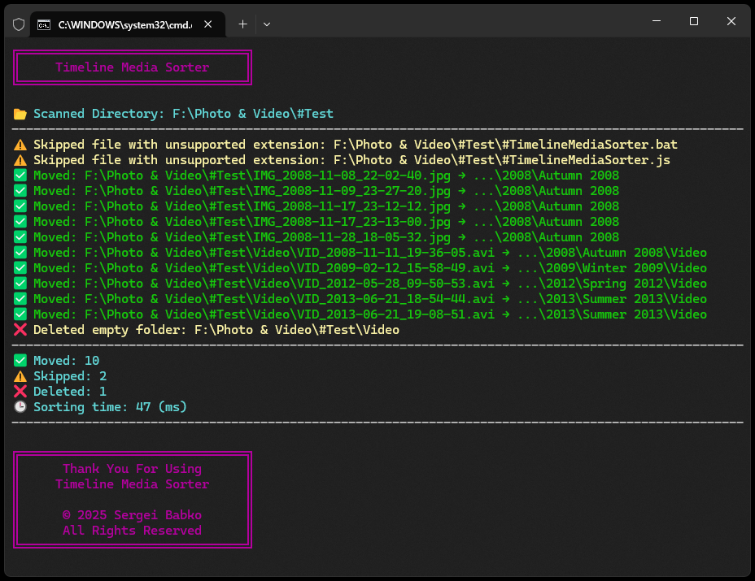

# 🗂 Timeline Media Sorter | [EN](https://github.com/SergeiBabko/Timeline-Media-Sorter)

<p align="center">
  
</p>

**TimelineMediaSorter** — это простой скрипт на Node.js, предназначенный для сортировки фото и видео по годам, сезонам или пользовательским событиям на основе даты, содержащейся в имени файла.

---

## 🏷️ Отлично сочетается с — [Timeline Media Renamer](https://github.com/SergeiBabko/Timeline-Media-Renamer)

---

## 🔧 Возможности

* Сканирует медиафайлы и автоматически распределяет их по папкам, например:

    * `2023/Весна 2023/`
    * `2024/Зима 2023/Видео/`
    * `Путешествия/Поездка в Италию 2025/`

* Извлекает дату из имени файла (например, `IMG_2025-03-15_12-30-56.jpg`)
* Поддерживает **пользовательские события**, которые вы задаете вручную — включая ежегодные
* Разделяет фото и видео по соответствующим папкам
* Пропускает неподдерживаемые форматы
* Удаляет пустые папки после сортировки
* Показывает результаты на русском или английском языке в зависимости от настроек системы
* Выводит краткое резюме со временем выполнения и количеством обработанных файлов

---

## 🚀 Как использовать

1. Установите [Node.js](https://nodejs.org)

2. Поместите скрипт в папку с медиафайлами

3. *(Опционально)* Настройте класс `TimelineMediaSorterSettings`:

    * `SAVE_LOGS` — `true` для сохранения логов или `false`, чтобы отключить
    * `CUSTOM_EVENTS_DATES` — список строк с пользовательскими событиями в формате `"DD.MM.YYYY"`:

        * Поддерживаются ежегодные события с годом `"x"` — например, `Рождество: 24.12.x-26.12.x`
        * Для событий на один день можно не указывать дату окончания события — например, `Моя Свадьба: 01.02.2015`
        * Если дата окончания раньше даты начала, событие считается переходящим через Новый год — например, `Новый Год: 31.12.x-01.01.x`
        * Используйте `|`, `\\` или `/` для создания вложенных папок — например:
        * События с указанным годом должны быть записаны ДО ежегодных событий

        ```js
        "НазваниеПапки|Событие": "датаНачала-датаОкончания"
        "НазваниеПапки\\Событие": "датаНачала-датаОкончания"
        "НазваниеПапки/Событие": "датаНачала-датаОкончания"
        ```

    * `IGNORED_DIRECTORIES` — список папок, которые не нужно сканировать (например, `#Ignored`)

4. Запуск:

    * Дважды кликните `#TimelineMediaSorter.bat`
    * Или выполните в терминале:

      ```bash
      node "#TimelineMediaSorter.js"
      ```

5. Готово — ваши файлы будут автоматически отсортированы по папкам с датами

---

## 📁 Возможные варианты форматирования пользовательских событий

| Описание формата                                                         | Синтаксис формата       | Пример                  | Дата начала  | Дата окончания |
|--------------------------------------------------------------------------| ----------------------- | ----------------------- | ------------ | -------------- |
| Фиксированное событие на один день                                       | `ДД.ММ.ГГГГ`            | `05.02.2000`            | `05.02.2000` | `05.02.2000`   |
| Фиксированное событие на несколько дней                                  | `ДД.ММ.ГГГГ-ДД.ММ.ГГГГ` | `10.03.2001-15.03.2001` | `10.03.2001` | `15.03.2001`   |
| Фиксированное многодневное событие, переходящее в следующий год          | `ДД.ММ.ГГГГ-ДД.ММ.ГГГГ` | `25.12.2001-05.01.2002` | `25.12.2001` | `05.01.2002`   |
| Фиксированное многодневное событие, переходящее через несколько лет      | `ДД.ММ.ГГГГ-ДД.ММ.ГГГГ` | `10.01.2002-10.01.2003` | `10.01.2002` | `10.01.2003`   |
| Повторяющееся однодневное событие с заданным диапазоном лет              | `ДД.ММ.ГГГГ_ГГГГ`       | `20.01.2004_2006`       | `20.01.2004` | `20.01.2006`   |
| Повторяющееся однодневное событие, начинающееся с указанного года        | `ДД.ММ.>ГГГГ`           | `25.01.>2007`           | `25.01.2007` | `25.01.x`      |
| Повторяющееся многодневное событие с фиксированной датой начала          | `ДД.ММ.ГГГГ-ДД.ММ.x`    | `30.01.2010-30.01.x`    | `30.01.2010` | `30.01.x`      |
| Повторяющееся многодневное событие с переходом через год                 | `ДД.ММ.ГГГГ-ДД.ММ.x`    | `25.12.2020-05.01.x`    | `25.12.2020` | `05.01.x`      |
| Повторяющееся многодневное событие с фиксированной датой конца           | `ДД.ММ.x-ДД.ММ.ГГГГ`    | `25.03.2015-30.03.x`    | `25.03.2015` | `30.03.x`      |
| Повторяющееся однодневное событие до указанного года                     | `ДД.ММ.<ГГГГ`           | `30.01.<1980`           | `30.01.x`    | `30.01.1980`   |
| Повторяющееся многодневное событие до фиксированной даты конца           | `ДД.ММ.x-ДД.ММ.ГГГГ`    | `30.01.x-30.01.1985`    | `30.01.x`    | `30.01.1985`   |
| Повторяющееся многодневное событие до фиксированной даты конца           | `ДД.ММ.x-ДД.ММ.ГГГГ`    | `25.01.x-30.01.1990`    | `25.01.x`    | `30.01.1990`   |
| Повторяющееся многодневное событие с переходом через год до даты конца   | `ДД.ММ.x-ДД.ММ.ГГГГ`    | `25.12.x-05.01.1995`    | `25.12.x`    | `05.01.1995`   |
| Повторяющееся однодневное событие без ограничения по году                | `ДД.ММ.x`               | `11.11.x`               | `11.11.x`    | `11.11.x`      |
| Повторяющееся многодневное событие без ограничения по году               | `ДД.ММ.x-ДД.ММ.x`       | `15.11.x-20.11.x`       | `15.11.x`    | `20.11.x`      |
| Повторяющееся многодневное событие с переходом через год без ограничений | `ДД.ММ.x-ДД.ММ.x`       | `31.12.x-01.01.x`       | `31.12.x`    | `01.01.x`      |

---

## 📁 Примеры пользовательских событий и других настроек

```js
class TimelineMediaSorterSettings {
  static SAVE_LOGS = false;                                                            // Отключить сохранение логов

  static CUSTOM_EVENTS_DATES = {
    'События и Конференции|Конференции|Техническая конференция 2023': '15.05.2023',    // Фиксированное однодневное событие
    'События и Конференции|Конференции|UX Саммит Европа': '10.06.2023-20.06.2023',     // Фиксированный многодневный период
    'События и Конференции|Фестивали|Зимний фестиваль': '30.12.2023-02.01.2024',       // Фиксированный диапазон через новый год

    'Годовщины|Работа|Годовщина работы': '01.09.2010_2020',                            // Повторяющееся событие с начальным и конечным годом
    'Годовщины|Работа|День компании': '15.03.>2015',                                   // Повторяющееся событие с начального года
    'Годовщины|Семья|День бабушки': '10.04.<2010',                                     // Повторяющееся событие до определенного года
    'Годовщины|Свадьбы|Анна и Том': '14.02.2015-20.02.x',                              // Повторяющийся многодневный период с фиксированной начальной датой
    'Годовщины|Свадьбы|Эмили и Джек': '10.06.x-14.06.2022',                            // Повторяющийся многодневный период до фиксированной конечной даты

    'Праздники|Культурные|День библиотеки': '12.09.x',                                 // Повторяющееся однодневное событие без ограничений
    'Праздники|Сезонные|Осенний лагерь': '01.10.x-15.10.x',                            // Повторяющийся многодневный период без ограничений
    'Праздники|Глобальные|Новый Год': '31.12.x-01.01.x',                               // Повторяющееся событие через новый год
    'Праздники|Весна|Весенний фестиваль': '21.03.>2018',                               // Повторяющееся событие с заданного года
    'Праздники|Старые|Старый день': '30.06.<1995',                                     // Повторяющееся событие до заданного года

    'Путешествия и Отдых|Тур по Европе|Приключение в Италии': [
      '05.05.2013-11.05.2013',
      '12.08.2019',
    ],                                                                                 // Несколько экземпляров одного события
    'Путешествия и Отдых|Семейные поездки|Поездка к бабушке': [
      '23.08.2008-24.08.2008',
      '05.06.2009-29.06.2009',
      '24.07.2012',
    ],                                                                                 // Несколько связанных визитов
  };

  static IGNORED_DIRECTORIES = [
    '#Сортировано',                                                                    // Пропустить эту папку
    '#Игнорируется',                                                                   // Пропустить эту папку
  ];

  static IGNORED_FILES = [
    '#TimelineMediaSorter.bat',                                                        // Пропустить этот файл
    '#TimelineMediaSorter.js',                                                         // Пропустить этот файл
  ];
}

```

---

## 📅 Автоматическая сортировка событий

Вы можете записывать ваши события в любом порядке — сортировщик автоматически обновит последовательность в зависимости от дат.

### 🔢 Порядок сортировки событий

1. События с фиксированной однодневной датой
2. События с фиксированным диапазоном дат
3. Однодневные повторяющиеся события с указанными годами начала и окончания
4. Однодневные повторяющиеся события с указанным только годом окончания
5. Однодневные повторяющиеся события с указанным только годом начала
6. Многодневные повторяющиеся события с указанными годами начала и окончания
7. Многодневные повторяющиеся события с указанным только годом окончания
8. Многодневные повторяющиеся события с указанным только годом начала
9. Однодневные повторяющиеся события без указания годов
10. Многодневные повторяющиеся события без указания годов

---

## 🗓️ Распознаваемые форматы дат в названиях файлов

| Формат                | Пример имени файла            | Интерпретируется как |
| --------------------- | ----------------------------- | -------------------- |
| `YYYY-MM-DD_HH-MM-SS` | `IMG_2025-01-25_15-43-22.jpg` | 25 января 2025       |
| `YYYY-MM-DD`          | `IMG_2025-01-25.jpg`          | 25 января 2025       |
| `DD-MM-YYYY_HH-MM-SS` | `IMG_25-01-2025_15-43-22.jpg` | 25 января 2025       |
| `DD-MM-YYYY`          | `IMG_25-01-2025.jpg`          | 25 января 2025       |
| `YYYY.MM.DD-HH.MM.SS` | `IMG_2025.01.25-12.30.45.jpg` | 25 января 2025       |
| `YYYY.MM.DD`          | `IMG_2025.01.25.jpg`          | 25 января 2025       |
| `DD.MM.YYYY-HH.MM.SS` | `IMG_25.01.2025-12.30.45.jpg` | 25 января 2025       |
| `DD.MM.YYYY`          | `IMG_25.01.2025.jpg`          | 25 января 2025       |
| `YYYYMMDD_HHMMSS`     | `IMG_20250125_102030.jpg`     | 25 января 2025       |
| `YYYYMMDD`            | `IMG_20250125.jpg`            | 25 января 2025       |

Парсер использует именованные группы (`year`, `month`, `day`) для извлечения даты.

Если имя файла содержит дату в одном из этих форматов, он будет отсортирован в соответствующую папку, например: `2025/Зима 2025/`.

Если дата не распознана — файл попадёт в папку `#Неизвестные Даты`.

---

## 📦 Поддерживаемые типы файлов

Скрипт автоматически обрабатывает следующие форматы:

### 🖼️ Изображения и фотографии

```
.jpg, .jpeg, .png, .gif, .bmp, .tiff, .tif, .heic, .heif, .webp,
.raw, .arw, .cr2, .nef, .orf, .sr2, .dng, .rw2, .raf, .psd,
.xcf, .ai, .indd, .svg, .eps, .pdf, .lrtemplate, .xmp
```

### 🎞️ Видео

```
.3gp, .mp4, .mov, .avi, .mkv, .webm, .flv, .wmv, .mpeg, .mpg, .m4v,
.mts, .m2ts, .vob, .rm, .rmvb, .asf, .divx, .xvid, .ogv, .ts, .mxf,
.f4v, .m2v, .mpv, .qt, .mng, .yuv, .y4m, .drc, .f4p, .f4a, .f4b
```

Остальные форматы игнорируются автоматически.

---

## 📁 Пример результата

```txt
📂 Фотографии
├── 📂 2025
│    ├── 📂 Весна 2025
│    │    ├── 🖼️ IMG_2025-03-18.jpg
│    │    └── 🖼️ IMG_2025-03-20.jpg
│    │
│    └── 📂 Лето 2025
│         ├── 📂 Видео
│         │    └── 🎞️ VID_2025-07-01.mp4
│         │
│         ├── 🖼️ IMG_2025-06-15.jpg
│         └── 🖼️ IMG_2025-07-23.jpg
│
├── 📂 Праздники
│    └── 📂 Новый Год
│         └── 📂 Новый Год 2024-2025
│              ├── 🖼️ IMG_2024-12-31.jpg
│              └── 🖼️ IMG_2025-01-01.jpg
│
├── 📂 #Неизвестные Даты
│    └── 🖼️ старое_фото.png
│
└── 📂 #Неизвестные Файлы
     ├── 📄️ неизвестный_файл.txt
     └── 🗃️ архив_с_фотографиями.zip
```

---

## ℹ️ Примечания

* Если дата не определена, файл помещается в папку `#Неизвестные Даты`
* Пользовательские события имеют приоритет над сезонными папками
* Видео размещаются в подпапке `Видео` соответствующей папки
* Пустые папки удаляются после сортировки
* Неподдерживаемые форматы файлов игнорируются
* Такие файлы перемещаются в папку `#Неизвестные Файлы` с сохранением их начальной структуры папок
* Папки из `IGNORED_DIRECTORIES` не сканируются
* Цветной вывод логов в консоль зависит от типа операции
* Если `SAVE_LOGS = true` — создается лог-файл `#TimelineMediaSorterLogs.txt` в корневой папке
* Если `SAVE_LOGS = false` — лог сохраняется только в консоли

---

## 📊 После завершения

* Показывает количество перемещённых, пропущенных и удалённых файлов
* Отображает общее время выполнения в понятной форме
* Резюме и системные сообщения выводятся на языке вашей системы
* Ошибки (например, сбои при перемещении) выделяются цветом
